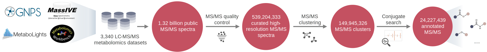
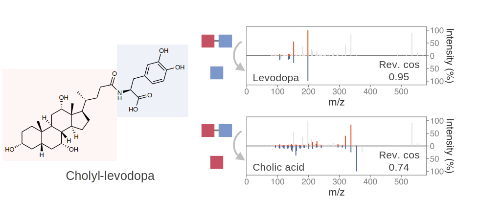
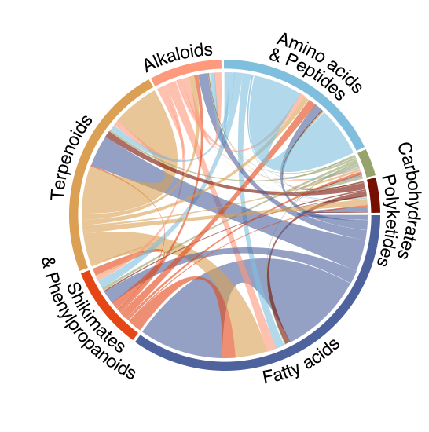
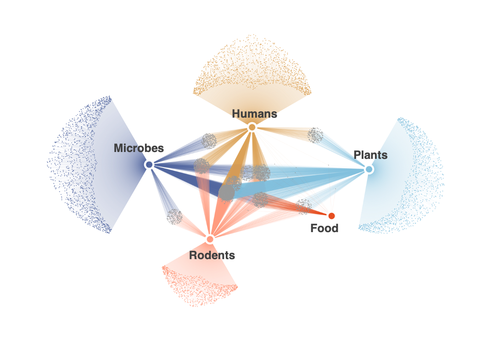

# Pan-repository conjugated metabolome

Life’s chemical diversity far exceeds current biochemical maps. While metabolomics has catalogued tens of thousands of small molecules, **conjugated metabolites**, formed when two or more molecular entities fuse through amidation, esterification, or related linkages, remain largely unexplored. These molecules can act as microbial signals, detoxification intermediates, or endogenous regulators, yet their global diversity is poorly characterized. Here, we mined 1.32 billion MS/MS spectra across public metabolomics repositories using reverse spectral searching and delta-mass analysis to infer conjugation events. We generated structural hypotheses for 24,227,439 spectra, encompassing 217,291 substructure pairs with dual spectral support and 3,412,720 additional candidates with single-match support. Predictions include host–microbe co-metabolites, diet-derived conjugates, and drug-derived species, including drug-ethanolamine and creatinine conjugates that may alter biological activity, and reveal steroid-phosphoethanolamine conjugates. We synthesized and confirmed 55 conjugates by MS/MS, 27 of which were validated by retention time. These results provide a pan-repository map of conjugation chemistry, establish a resource for structural discovery, and offer a framework to further explore the potential scale and diversity of the conjugated metabolome.

<table width="100%" border="0">
<tr>
  <td width="65%" align="center" valign="center">
    
  </td>
  <td width="35%" align="center">
    
  </td>
  <!-- <td width="30%" align="center">
    
  </td> -->
</tr>
</table>

## Reverse spectral search
Reverse spectral search is a template-based MS/MS similarity framework originally proposed for spectral identification and later extended to improve robustness to chimeric spectra. Here, we repurpose reverse spectral searching for substructure annotation. By treating the reference spectrum as a template and scoring only fragment ions characteristic of that structure, reverse spectral search captures partial structural overlap without penalization from additional fragments present in the query spectrum.
Here, we provide two implementations of reverse cosine similarity:
- [matchms](https://github.com/matchms/matchms)-based reverse cosine: [revcos.py](https://github.com/Philipbear/conjugated_metabolome/blob/main/bin/revcos_matchms/revcos.py)
- [Flash](https://github.com/YuanyueLi/FlashEntropySearch) reverse cosine: [flash_revcos.py](https://github.com/Philipbear/conjugated_metabolome/blob/main/bin/main/flash_cos.py)

## Data
- Conjugate search results of 149.9 million clustered MS/MS: [Zenodo link](https://zenodo.org/records/17245769)
- GNPS conjugated metabolome libraries: [GNPS external library link](https://external.gnps2.org/gnpslibrary)
- Web app to explore conjugated metabolome results: [Web app link](https://conjugated-metabolome.streamlit.app)
- Datasets
  - [MSV000086131](https://massive.ucsd.edu/ProteoSAFe/QueryMSV?id=MSV000086131) (Mammalian feces)
  - [MSV000082261](https://massive.ucsd.edu/ProteoSAFe/QueryMSV?id=MSV000082261) (Diabetes study)
  - [MSV000082433](https://massive.ucsd.edu/ProteoSAFe/QueryMSV?id=MSV000082433) (Human feces, losartan conjugates)
  - [MSV000083306](https://massive.ucsd.edu/ProteoSAFe/QueryMSV?id=MSV000083306) (Tomato seedling extracts)
  - [MSV000098638](https://massive.ucsd.edu/ProteoSAFe/QueryMSV?id=MSV000098638) (Microbial cultures)
  - [MSV000099690](https://massive.ucsd.edu/ProteoSAFe/QueryMSV?id=MSV000099690) (Chemical synthesis & RT matching)
- MS/MS reference libraries
  - GNPS ([ALL_GNPS_NO_PROPOGATED.msp](https://external.gnps2.org/gnpslibrary), downloaded on Nov 11, 2024)
  - MassBank ([MassBank_NIST.msp](https://github.com/MassBank/MassBank-data/releases/tag/2024.06), 2024.06 release)
  - MoNA ([MoNA-export-LC-MS-MS_Spectra.msp](https://mona.fiehnlab.ucdavis.edu/downloads), downloaded on Oct 17, 2024)
  - NIST20 (Commercially available)

## Citation
> S. Xing. Navigation of the pan-repository conjugated metabolome. https://github.com/Philipbear/conjugated_metabolome

## License
This work is licensed under the Apache License 2.0.
